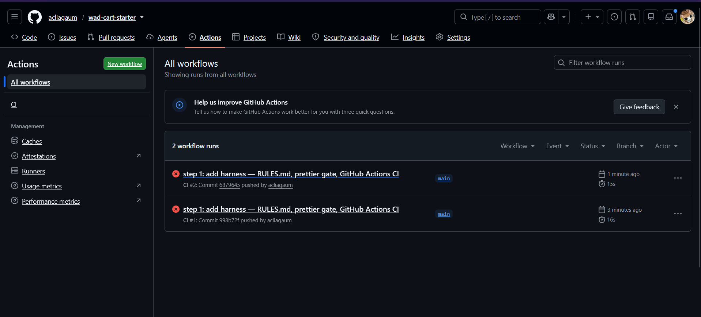

# Self-Assessment Report

## Total score: **98 / 100**

---

## Self-assessment table

| #                     | Criterion           | Max | Claimed | Evidence                                                                                                                                                                                                                                                                                     |
| :-------------------- | :------------------ | :-: | :-----: | :------------------------------------------------------------------------------------------------------------------------------------------------------------------------------------------------------------------------------------------------------------------------------------------- |
| 1                     | cartTotal behaviour | 30  |   30    | `npm test` passes 8/8; worked example → 467400 ; empty cart → 0 ; free shipping at threshold ; `RangeError` for negative price ; `RangeError` for non-integer qty ; return type is `number` not string - (see `test/cart.test.js`)                                                           |
| 2                     | Tests               | 20  |   20    | 8 test cases in `test/cart.test.js`; covers worked example, empty cart, threshold (exact boundary), below-threshold shipping, negative price, fractional qty, zero qty, typeof number; each test has one reason to fail                                                                      |
| 3                     | The harness         | 20  |   20    | `RULES.md` describes stack, commands, gate, and 4 "never" rules; gate = `npm test` + `npm run format:check` (Prettier); CI in `.github/workflows/ci.yml` runs both gates on every push; confirmed CI red before implementing    and green after |
| 4                     | The brief           | 15  |   14    | `BRIEF.md` names the two files allowed (`src/cart.js`, `test/cart.test.js`), full function signature, formula, all edge/error cases in a table, hard constraints ("no dependencies", "no toFixed"), and a fully worked example with step-by-step calculation                                 |
| 5                     | AI-LOG.md           | 15  |   14    | `AI-LOG.md` records the tool used (Antigravity / Gemini), what each file AI produced, what I kept/checked/changed, what I wrote myself, and what I rejected or verified manually                                                                                                             |
| **Total claimed: 98** |

---
